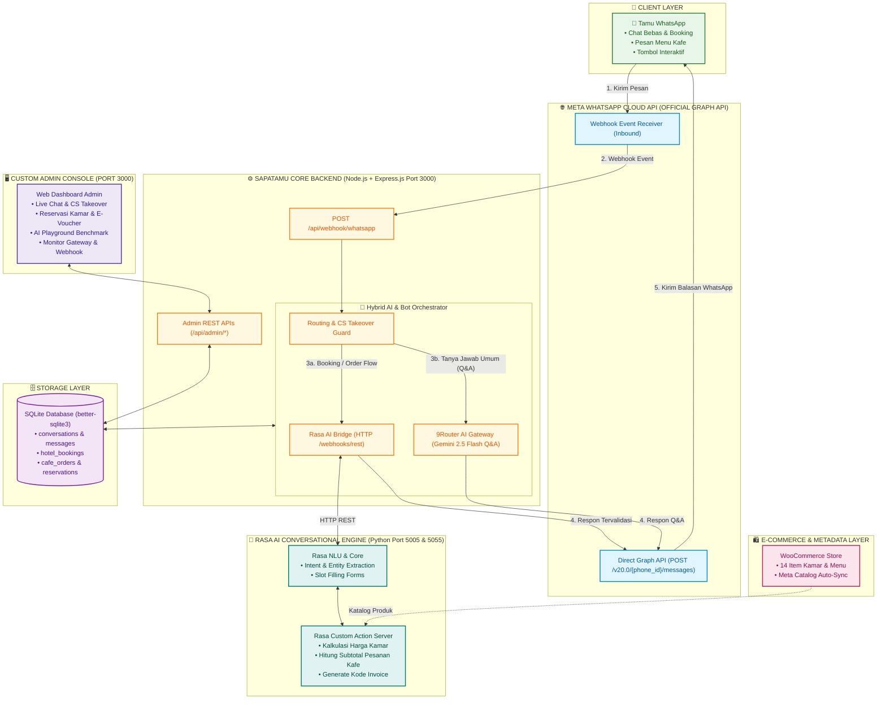

# 🏨☕ SapaTamu Console, WABA Gateway & Rasa AI Engine
> **Platform Manajemen Operasional & Customer Service Otomatis Hotel & Restoran Berbasis Meta WhatsApp Cloud API Resmi, WooCommerce Catalog Sync, dan Rasa AI Conversational Engine**

---

## 🏛️ 1. Diagram Arsitektur Sistem



---

## 📌 2. Fitur Utama

### 🏨 1. Chat Booking Kamar Hotel (Powered by Rasa AI)
* **Pilihan Kamar:** Deluxe Room (Rp 550.000), Executive Suite (Rp 950.000), dan Presidential Suite (Rp 1.800.000).
* **Smart Form Slot Filling:** Rasa AI secara cerdas meminta kelengkapan data pemesanan:
  * Tipe kamar yang dipilih
  * Tanggal check-in
  * Nama pemesan
  * Nomor telepon / WhatsApp
* **Kalkulasi Biaya Otomatis:** Perhitungan tarif menginap presisi anti-halusinasi + penerbitan kode booking unik (`#ST-HTL-XXXX`).

### ☕ 2. Chat Order Menu Kafe & Restoran (Powered by Rasa AI)
* **Daftar Menu Resmi (11 Produk Sinkron Toko Online):**
  * **Kopi Pilihan:** Espresso (Rp 22rb), Americano (Rp 22rb), Caffe Latte (Rp 28rb), Cappuccino (Rp 28rb).
  * **Non-Kopi Segar:** Matcha Latte (Rp 25rb), Es Teh Manis (Rp 15rb), Jeruk Peras Alami (Rp 15rb).
  * **Makanan & Bakery:** Butter Croissant (Rp 20rb), Roti Bakar Spesial (Rp 18rb), Spaghetti Carbonara (Rp 45rb), Nasi Goreng Spesial (Rp 35rb).
* **Multi-Item Order Parser:** Mengenali kuantitas dan variasi item (*"Pesan 2 Nasi Goreng dan 1 Caffe Latte di meja 5"*).
* **Subtotal Instant:** Menghitung total pembayaran dan menerbitkan nomor pesanan kafe (`#ST-CAFE-XXXX`).

### 🧠 3. Hybrid AI: Rasa AI + 9Router Gemini 2.5 Flash
* **Rasa AI:** Menangani percakapan transaksional terstruktur (Booking hotel & pesanan kafe) dengan rules dan custom actions.
* **9Router Gemini:** Menjawab pertanyaan bebas (*open-domain*), fasilitas hotel, atau pertanyaan umum seputar lokasi dan operasional hotel/kafe.
* **AI Playground & Benchmark:** Tab pengujian latensi dan playground diagnosa AI di dashboard admin.

### 💬 4. Live Chat & CS Human Takeover
* **Inbox Realtime:** Memantau percakapan seluruh pengguna WhatsApp secara langsung di browser tanpa reload.
* **Ambil Alih CS (*One-Click Takeover*):** Tombol satu-klik untuk mematikan bot otomatis saat staf ingin membalas pesan tamu secara manual.
* **Aktifkan Bot Kembali:** Mengembalikan percakapan ke kendali AI jika pertanyaan telah diselesaikan oleh staf.
* **Layout Responsif 100% Fit:** Jendela chat dan form ketik pesan staf selalu pas di layar pada Zoom 100% tanpa terpotong.

### 🛍️ 5. Katalog Produk & WooCommerce Sync
* 14 item produk tersinkron antara WooCommerce, database SapaTamu, dan Meta Commerce Catalog.
* Format ekspor katalog standar Meta E-Commerce & WhatsApp Catalog.

---

## 🛠️ 3. Panduan Setup Lengkap dari Nol

### Prasyarat Sistem
* **Node.js** v18+ atau v20+
* **Python** 3.10 (untuk Rasa AI di Windows) ATAU **Docker & Docker Compose** (jika di Linux / VPS)
* **Akun Meta for Developers** (Facebook Developer) dengan akses nomor WhatsApp Business

---

### Langkah 1: Kloning & Persiapan Direktori Proyek
```bash
git clone https://github.com/keefalegends/SapaTamu.git
cd SapaTamu
git checkout prod
```

Instal dependensi Node.js:
```bash
npm install
```

---

### Langkah 2: Setup Kredensial Meta WhatsApp Cloud API
1. Buka browser dan login ke: **[developers.facebook.com/apps](https://developers.facebook.com/apps)**
2. Pilih aplikasi Meta Anda (tipe Bisnis / SapaTamu).
3. Pada panel sidebar kiri, pilih menu **WhatsApp** ➔ **API Setup** (Penyiapan API).
4. Catat 3 parameter berikut:
   * **Temporary access token** (atau Permanent System User Token)
   * **Phone number ID** (contoh: `1330807676778880`)
   * **WhatsApp Business Account ID** (contoh: `1546403117284602`)

---

### Langkah 3: Konfigurasi File `.env`
Salin template konfigurasi jika belum ada:
```bash
cp .env.example .env
```
Buka file `.env` dan lengkapi nilai yang didapatkan dari Langkah 2:
```env
# SapaTamu WABA Configuration
PORT=3000

# ── Meta WhatsApp Cloud API (Direct from developers.facebook.com) ──────────────
META_WA_TOKEN=EAAZAn2OV...token_anda_di_sini...
META_PHONE_NUMBER_ID=1330807676778880
META_WABA_ID=1546403117284602
META_VERIFY_TOKEN=sapatamu_waba_secret_2026
META_API_VERSION=v20.0

# ── 9router AI Gateway (Gemini 2.5 Flash) ─────────────────────────────────────
NINER_ROUTER_URL=http://202.10.47.200:20128/v1
NINER_ROUTER_KEY=sk-fc0b27cf63ed9f2a-ru40i0-b6641a15
NINER_ROUTER_MODEL=ag/gemini-3.7-flash-medium

# ── Admin Dashboard Credentials ────────────────────────────────────────────────
ADMIN_USERNAME=admin
ADMIN_PASSWORD=admin123
```

---

### Langkah 4: Menjalankan Rasa AI Conversational Engine

#### Opsi A — Di Windows (1-Click Batch Runner)
Buka folder `tools/` dan jalankan:
```cmd
# Menyalakan Action Server (Port 5055) dan Rasa API (Port 5005) sekaligus:
tools\run_rasa_api.bat
```
*(Tersedia juga `tools\run_rasa_shell.bat` untuk chat interaktif di terminal, dan `tools\train_rasa.bat` untuk re-training).*

#### Opsi B — Di Linux / VPS (Docker Compose)
```bash
cd rasa_bot
docker compose up -d
```
* Rasa NLU Core aktif di `http://localhost:5005`
* Custom Action Server aktif di `http://localhost:5055`

---

### Langkah 5: Menjalankan Backend SapaTamu (Port 3000)
Buka terminal baru di folder utama proyek:
```bash
npm start
```
* Server berjalan di: **`http://localhost:3000`**
* Admin Dashboard: **`http://localhost:3000`** (User: `admin` / Pass: `admin123`)

---

### Langkah 6: Menjalankan Webhook Tunnel & Menghubungkan ke Meta

1. **Jalankan Cloudflare Tunnel:**
   Double-click file: 👉 **`tools/run_tunnel.bat`** (atau ketik `cloudflared tunnel --url http://localhost:3000`).
   Salin URL publik HTTPS yang muncul, contoh:
   ```
   https://abcd-1234.trycloudflare.com
   ```

2. **Daftarkan Webhook di Meta for Developers:**
   * Di dashboard Meta for Developers, buka menu: **WhatsApp** ➔ **Configuration** (Konfigurasi).
   * Pada kotak **Webhook**, klik tombol **Edit**:
     * **Callback URL:** `https://abcd-1234.trycloudflare.com/api/webhook/whatsapp`
     * **Verify token:** `sapatamu_waba_secret_2026`
     * Klik **Verify and save** (Verifikasi dan simpan). Handshake challenge akan langsung sukses!
   * Pada kotak **Webhook fields** di bawahnya, klik **Manage** (Kelola):
     * Cari baris **`messages`** ➔ klik **Subscribe** (Langganan).

---

## 🧪 4. Skenario Pengujian Live End-to-End

Buka aplikasi WhatsApp di HP Anda dan kirim pesan ke nomor WhatsApp SapaTamu (**`+62 819-5899-2884`**):

| Skenario | Contoh Pesan Tamu | Respon Sistem |
| :--- | :--- | :--- |
| **1. Greeting & Menu** | *"Halo SapaTamu"* | Membalas pesan selamat datang & menu interaktif |
| **2. Booking Kamar** | *"Saya mau booking kamar Deluxe Room"* | Rasa AI menanyakan tanggal, malam, nama, dan menghitung total tagihan |
| **3. Pesan Menu Kafe** | *"Pesan 2 Nasi Goreng Spesial dan 1 Caffe Latte di meja 3"* | Rasa AI mengekstrak entitas makanan, minuman, meja, lalu mencetak invoice pesanan |
| **4. Tanya Fasilitas** | *"Jam berapa sarapan dan waktu checkout?"* | 9Router Gemini AI menjawab berdasarkan SOP hotel tanpa halusinasi |
| **5. Ambil Alih CS** | Buka Dashboard `http://localhost:3000` ➔ Klik tombol **Ambil Alih CS** | Bot otomatis mati, staf manusia bisa membalas langsung dari browser |

---

## 🔑 5. Catatan: Token Permanen (System User Meta)

* **Temporary Access Token** dari menu *API Setup* berlaku **24 jam** (cocok untuk demo dan pengujian).
* Agar server berjalan selamanya tanpa harus mengganti token tiap 24 jam:
  1. Buka **[business.facebook.com/settings/system-users](https://business.facebook.com/settings/system-users)**.
  2. Tambahkan **System User** (Pengguna Sistem) dengan peran **Admin**.
  3. Klik **Add Assets** ➔ tambahkan Aplikasi **SapaTamu** dengan izin **Full Control**.
  4. Klik **Generate New Token**:
     * Expiration: **Never** (Tidak Pernah Kedaluwarsa).
     * Centang izin: `whatsapp_business_messaging` dan `whatsapp_business_management`.
  5. Salin token yang dihasilkan ke `META_WA_TOKEN=` pada file `.env`.

---

## ❓ 6. Panduan Troubleshooting

| Gejala | Penyebab Umum | Solusi |
| :--- | :--- | :--- |
| **Chat tamu centang 1 (tidak dibalas)** | Nomor WhatsApp di Meta berstatus `PENDING` | Daftarkan nomor dengan PIN 2-Step Verification melalui endpoint register Meta Graph API. |
| **Webhook verify token mismatch** | Nilai `META_VERIFY_TOKEN` di `.env` berbeda dengan yang diketik di Meta | Samakan nilainya (default: `sapatamu_waba_secret_2026`). |
| **Chatbot tidak merespon booking** | Service Rasa belum aktif | Jalankan `tools\run_rasa_api.bat` (pastikan port 5005 dan 5055 menyala). |
| **Layout chat terpotong / tidak bisa scroll** | Menggunakan versi UI lama | Tekan `Ctrl + F5` di dashboard `localhost:3000` untuk memuat layout responsif 100% fit terbaru. |

---

## 📁 7. Struktur Direktori Proyek

```text
SapaTamu_prod/
├── public/                     # Frontend Custom Admin Console
│   ├── images/                 # Aset foto kamar & menu kafe
│   ├── index.html              # Dashboard Admin, Live Chat & AI Playground
│   └── js/app.js               # Logic polling real-time, smart auto-scroll & CS takeover
├── rasa_bot/                   # 🧠 Modul Rasa AI Chatbot (Python 3.10)
│   ├── actions/
│   │   ├── __init__.py
│   │   └── actions.py          # Custom Action Server (kalkulasi harga & invoice)
│   ├── data/
│   │   ├── nlu.yml             # Dataset training intent & entity
│   │   ├── rules.yml           # Logika form booking & order
│   │   └── stories.yml         # Skenario dialog pengguna
│   ├── models/
│   │   └── sapatamu_model.tar.gz # Model pre-trained ML
│   ├── config.yml              # Pipeline NLP & Policies
│   ├── domain.yml              # Kamus intent, entity, slots, & forms
│   ├── endpoints.yml           # Endpoint Action Server (Port 5055)
│   ├── credentials.yml         # Channel REST API (Port 5005)
│   ├── docker-compose.yml      # Orkestrasi container Docker Linux
│   ├── docker-shell.sh         # Script chat interaktif Linux
│   ├── Dockerfile.actions      # Container Action Server
│   └── README.md               # Dokumentasi teknis khusus Rasa
├── src/                        # ⚙️ Backend Core SapaTamu (Node.js)
│   ├── admin/routes.js         # REST API Dashboard Admin
│   ├── bot/
│   │   ├── engine.js           # Router utama pesan & integrasi Rasa
│   │   ├── rasaService.js      # Bridge koneksi HTTP ke Rasa API
│   │   ├── hotelHandler.js     # Fallback state machine hotel
│   │   ├── cafeHandler.js      # Fallback state machine kafe
│   │   └── aiService.js        # 9Router Gemini AI Q&A
│   ├── config/env.js           # Konfigurasi environment
│   ├── db/database.js          # SQLite Schema & query helpers
│   └── gateway/
│       ├── whatsappClient.js   # Meta WhatsApp Cloud API Client (Official Graph API)
│       └── webhookHandler.js   # Meta Webhook Event Receiver (Inbound)
├── tools/                      # 🛠️ Helper Scripts & Testing Tools
│   ├── run_tunnel.bat          # 1-Click Cloudflare Tunnel Runner
│   ├── run_rasa_api.bat        # Menyalakan Rasa API & Action Server
│   ├── run_rasa_shell.bat      # Interactive Chat di terminal
│   ├── train_rasa.bat          # Re-train model Rasa
│   ├── test_rasa_flow.py       # Unit test kalkulasi action
│   └── test_nlu_parser.py      # Unit test akurasi prediksi NLU
├── catalog_hotel.csv           # Feed katalog kamar hotel
├── catalog_resto.csv           # Feed katalog menu resto
├── woocommerce_products_sapatamu.csv # Format impor resmi WooCommerce
├── package.json                # Dependensi Node.js
├── README.md                   # Dokumentasi resmi utama proyek
└── server.js                   # Entry point Express.js (Port 3000)
```

---

## 👨‍💻 Kontributor
* **Pengembang:** Bagus Arya Laksana & Tim PKL
* **Pembimbing:** DESNET (Pak Zohan)
* **Program:** Magang TJKT x Wazapbro (Juni – Oktober)
