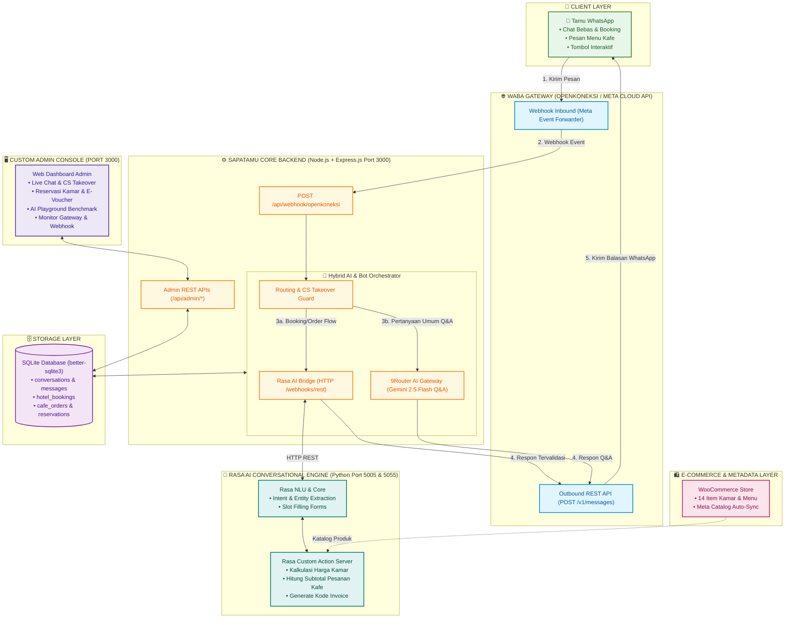

# 🏨☕ SapaTamu Console, WABA Gateway & Rasa AI Engine
> **Platform Manajemen Operasional & Customer Service Otomatis Hotel & Restoran Berbasis WhatsApp Cloud API, WooCommerce Catalog Sync, dan Rasa AI Conversational Engine**

---

## 🏛️ 1. Diagram Arsitektur Sistem



---

## 📌 2. Fitur Utama

### 🏨 1. Chat Booking Kamar Hotel (Powered by Rasa AI)
* **Pilihan Kamar:** Deluxe Room (Rp 550.000), Executive Suite (Rp 950.000), dan Presidential Suite (Rp 1.800.000).
* **Smart Form Slot Filling:** Rasa AI secara cerdas mengejar kelengkapan data pemesanan:
  * Tipe kamar yang dipilih
  * Tanggal check-in
  * Nama pemesan
  * Nomor telepon / WhatsApp
* **Kalkulasi Biaya Otomatis:** Perhitungan tarif menginap presisi anti-halusinasi + penerbitan kode booking unik (`#ST-HTL-XXXX`).

### ☕ 2. Chat Order Menu Kafe & Restoran (Powered by Rasa AI)
* **Daftar Menu Resmi (11 Produk dari Toko Online):**
  * **Kopi Pilihan:** Espresso (Rp 22rb), Americano (Rp 22rb), Caffe Latte (Rp 28rb), Cappuccino (Rp 28rb).
  * **Non-Kopi Segar:** Matcha Latte (Rp 25rb), Es Teh Manis (Rp 15rb), Jeruk Peras Alami (Rp 15rb).
  * **Makanan & Bakery:** Butter Croissant (Rp 20rb), Roti Bakar Spesial (Rp 18rb), Spaghetti Carbonara (Rp 45rb), Nasi Goreng Spesial (Rp 35rb).
* **Multi-Item Order Parser:** Mengenali kuantitas dan variasi item (*"Pesan 2 Nasi Goreng dan 1 Caffe Latte"*).
* **Subtotal Instant:** Menghitung total pembayaran dan menerbitkan nomor pesanan kafe (`#ST-CAFE-XXXX`).

### 🧠 3. Hybrid AI: Rasa AI + 9Router Gemini 2.5 Flash
* **Rasa AI:** Menangani percakapan transaksional terstruktur (Booking hotel & pesanan kafe).
* **9Router Gemini:** Menjawab pertanyaan bebas (*open-domain*), fasilitas hotel, atau pertanyaan umum seputar lokasi dan operasional.
* **AI Playground & Benchmark:** Tab pengujian latensi dan playground diagnosa AI di dashboard admin.

### 💬 4. Live Chat & CS Human Takeover
* **Inbox Realtime:** Memantau percakapan seluruh pengguna WhatsApp secara langsung.
* **Ambil Alih CS (*One-Click Takeover*):** Tombol satu-klik untuk mematikan bot otomatis saat staf ingin membalas pesan tamu secara manual.
* **Aktifkan Bot Kembali:** Mengembalikan percakapan ke kendali AI jika pertanyaan telah diselesaikan oleh staf.

### 🛍️ 5. Katalog Produk & WooCommerce Sync
* 14 item produk tersinkron antara WooCommerce, database SapaTamu, dan Meta Commerce Catalog.
* Format ekspor katalog standar Meta E-Commerce & WhatsApp Catalog.

---

## 🚀 3. Panduan Menjalankan Sistem

### A. Menjalankan Backend SapaTamu (Node.js)
```bash
# 1. Masuk ke direktori proyek
cd c:\kerjaanwoe\PKL-Desnet\SapaTamu_prod

# 2. Jalankan server
npm start
```
* Dashboard Admin: **`http://localhost:3000`**

---

### B. Menjalankan Rasa AI di Windows (Development)
Tersedia script 1-klik di folder `tools/`:

1. **Jalankan Rasa API & Action Server Sekaligus:**
   * Double-click file: 👉 **`tools/run_rasa_api.bat`**
   * *Otomatis menyalakan Action Server (port 5055) dan Rasa API (port 5005).*

2. **Menguji Chat Interaktif di Terminal:**
   * Double-click file: 👉 **`tools/run_rasa_shell.bat`**

3. **Re-train Model Rasa:**
   * Double-click file: 👉 **`tools/train_rasa.bat`**

---

### C. Menjalankan Rasa AI di Linux / VPS (Docker)
Bagi pengguna Linux (Ubuntu, Debian, dll.) atau server VPS tanpa perlu menginstal Python secara manual:

```bash
cd rasa_bot

# 1. Mode Interactive Chat Terminal (Langsung Ngobrol di Linux)
chmod +x docker-shell.sh
./docker-shell.sh

# 2. Mode Background Server 24/7 (Daemon)
docker compose up -d
```
* Endpoint Rasa API: `http://localhost:5005`
* Endpoint Action Server: `http://localhost:5055`

---

## 🌐 4. Menghubungkan ke WhatsApp Asli (Webhook Tunnel)

Untuk menerima pesan dari WhatsApp secara online ke laptop lokal:

1. Buka terminal baru, jalankan tunnel:
   ```bash
   npx localtunnel --port 3000
   ```
   *(Atau gunakan Cloudflare Tunnel: `npx cloudflared tunnel --url http://localhost:3000`)*
2. Salin URL publik yang didapatkan, misalnya: `https://sapatamu-tunnel.loca.lt`
3. Daftarkan di portal **OpenKoneksi.com** / **Meta Developer**:
   * **Webhook URL:** `https://sapatamu-tunnel.loca.lt/api/webhook/openkoneksi`
   * **Verify Token:** `sapatamu_waba_secret_2026`
   * **Subscription:** Centang `messages`

---

## 📁 5. Struktur Direktori Proyek

```text
SapaTamu_prod/
├── public/                     # Frontend Custom Admin Console
│   ├── images/                 # Aset foto kamar & menu kafe
│   ├── index.html              # Dashboard Admin & AI Playground
│   └── js/app.js               # Logic polling & CS takeover UI
├── rasa_bot/                   # 🧠 Modul Rasa AI Chatbot (Python 3.10)
│   ├── actions/
│   │   ├── __init__.py
│   │   └── actions.py          # Custom Action Server (kalkulasi harga & invoice)
│   ├── data/
│   │   ├── nlu.yml             # Dataset training intent & entity
│   │   ├── rules.yml           # Logika form booking & order
│   │   └── stories.yml         # Skenario dialog pengguna
│   ├── models/
│   │   └── sapatamu_model.tar.gz # Model pre-trained ML
│   ├── config.yml              # Pipeline NLP & Policies
│   ├── domain.yml              # Kamus intent, entity, slots, & forms
│   ├── endpoints.yml           # Endpoint Action Server
│   ├── credentials.yml         # Channel REST API
│   ├── docker-compose.yml      # Orkestrasi container Docker Linux
│   ├── docker-shell.sh         # Script chat interaktif Linux
│   ├── Dockerfile.actions      # Container Action Server
│   └── README.md               # Dokumentasi khusus Rasa
├── src/                        # ⚙️ Backend Core SapaTamu (Node.js)
│   ├── admin/routes.js         # REST API Dashboard Admin
│   ├── bot/
│   │   ├── engine.js           # Router utama pesan & integrasi Rasa
│   │   ├── rasaService.js      # Bridge koneksi HTTP ke Rasa API
│   │   ├── hotelHandler.js     # Fallback state machine hotel
│   │   ├── cafeHandler.js      # Fallback state machine kafe
│   │   └── aiService.js        # 9Router Gemini AI Q&A
│   ├── config/env.js           # Konfigurasi environment
│   ├── db/database.js          # SQLite Schema & query helpers
│   └── gateway/
│       ├── openkoneksiClient.js# Outbound REST API Client
│       └── webhookHandler.js   # Inbound Webhook Receiver
├── tools/                      # 🛠️ Helper Scripts & Testing Tools
│   ├── run_rasa_api.bat        # Menyalakan Rasa API & Action Server
│   ├── run_rasa_shell.bat      # Interactive Chat di terminal
│   ├── train_rasa.bat          # Re-train model Rasa
│   ├── test_rasa_flow.py       # Unit test kalkulasi action
│   └── test_nlu_parser.py      # Unit test akurasi prediksi NLU
├── catalog_hotel.csv           # Feed katalog kamar hotel
├── catalog_resto.csv           # Feed katalog menu resto
├── woocommerce_products_sapatamu.csv # Format impor resmi WooCommerce
├── package.json                # Dependensi Node.js
├── README.md                   # Dokumentasi resmi utama proyek
└── server.js                   # Entry point Express.js (Port 3000)
```

---

## 👨‍💻 Kontributor
* **Pengembang:** Bagus Arya Laksana & Tim PKL
* **Pembimbing:** DESNET (Pak Zohan)
* **Program:** Magang TJKT x Wazapbro (Juni – Oktober)
