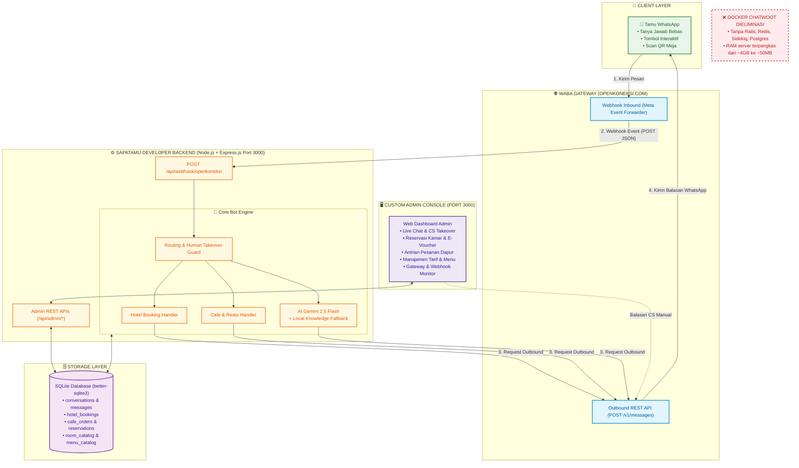

# 🏨☕ SapaTamu Console & WABA Gateway
> **Platform Manajemen Operasional & Customer Service Otomatis Hotel & Restoran Berbasis WhatsApp Cloud API (Murni API via OpenKoneksi.com, Tanpa Docker Chatwoot)**

---

## 🏛️ 1. Diagram Arsitektur Sistem



---

## 📌 2. Fitur Utama

### 💬 Live Chat & CS Takeover (Pengganti Chatwoot)
* **Inbox Realtime:** Memantau percakapan seluruh pengguna WhatsApp secara langsung.
* **Ambil Alih CS (*One-Click Takeover*):** Tombol satu-klik untuk mematikan bot otomatis saat staf ingin membalas pesan tamu secara manual.
* **Aktifkan Bot Kembali:** Mengembalikan percakapan ke kendali bot otomatis jika masalah telah diselesaikan.

### 🏨 Pemesanan Kamar Hotel End-to-End
* **Katalog Kamar Interaktif:** Deluxe Room, Executive Suite, dan Presidential Suite lengkap dengan foto kamar dan fasilitas.
* **Smart Entity Parser:** Tamu bebas mengetik tanggal dan durasi (*"Besok 2 malam atas nama Budi"*) ➡️ kalkulasi otomatis durasi, tarif malam, dan tanggal check-in.
* **Draft Invoice & Pembayaran:** Rincian biaya otomatis dengan opsi simulasi QRIS atau Virtual Account BCA.
* **Penerbitan E-Voucher Resmi:** Terbit nomor booking unik (`#SPT-YYMMDD-XXXX`) yang langsung tercatat di database reservasi.

### ☕ Self-Ordering Kafe & Restoran
* **Self-Ordering via QR Meja:** Scan QR di meja (misal `Meja 04`) ➡️ sistem langsung mengenali lokasi meja tamu.
* **Pemesanan Takeaway:** Opsi pesan bungkus untuk diambil di kasir.
* **Multi-Word Menu Parser:** Mengenali pesanan variatif (*"1 nasi goreng"*, *"2 es teh"*) dan menambahkan ke keranjang belanja.
* **Antrian Dapur Realtime:** Pesanan terbit dengan kode (`#KFE-YYMMDD-XXXX`) dan masuk ke antrian operasional dapur di dashboard.
* **Reservasi Meja Restoran:** Form jumlah tamu (pax) dan waktu kedatangan tercatat di sistem reservasi.

### 🧠 AI Customer Service & Local Failover
* **Gemini 2.5 Flash Integration:** Menjawab pertanyaan seputar hotel, fasilitas, dan kafe secara cerdas.
* **Smart Local Knowledge Fallback:** Jika koneksi AI eksternal atau internet terganggu, sistem secara otomatis menjawab pertanyaan umum (*check-in/out*, lokasi, *wifi*, harga) langsung dari basis data lokal `data.json` tanpa pernah *down*.

---

## 🚀 3. Panduan Setup & Menjalankan Proyek

### Langkah 1: Kebutuhan Sistem
* **Node.js** (v18.x, v20.x, atau v24.x)
* **Web Browser** (Chrome / Edge / Firefox)
* Terminal (PowerShell / Command Prompt / Bash)

### Langkah 2: Konfigurasi Environment (`.env`)
Pastikan file `.env` sudah tersedia di direktori proyek:
```env
PORT=3000

# OpenKoneksi Gateway
OPENKONEKSI_API_URL=https://api.openkoneksi.com/v1
OPENKONEKSI_API_KEY=YOUR_OPENKONEKSI_API_KEY
OPENKONEKSI_PHONE_ID=1289827514206711
OPENKONEKSI_WEBHOOK_SECRET=sapatamu_waba_secret_2026

# AI Engine (Gemini 2.5 Flash via 9router)
NINER_ROUTER_URL=https://riwxk5s.abc-tunnel.us/v1
NINER_ROUTER_KEY=sk-fb2a60ff904fde93-x717jq-86f104ed
NINER_ROUTER_MODEL=gc/gemini-2.5-flash
```
*(Catatan: Jika dijalankan tanpa API key OpenKoneksi asli, sistem otomatis mengaktifkan mode simulasi aman sehingga server tetap dapat digunakan tanpa error).*

### Langkah 3: Menjalankan Server Lokal
```bash
# Masuk ke direktori proyek
cd c:\kerjaanwoe\PKL-Desnet\SapaTamu_prod

# Jalankan server
npm start
```
Buka browser ke alamat: **`http://localhost:3000`**

---

## 🌐 4. Menghubungkan ke WhatsApp Asli via Tunnel

Untuk menerima pesan dari WhatsApp secara online, port 3000 perlu diekspos ke internet:

### Cara A: Menggunakan Cloudflare Tunnel (Paling Direkomendasikan & 100% Gratis)
Buka terminal baru, lalu jalankan:
```powershell
npx cloudflared tunnel --url http://localhost:3000
```
Terminal akan memberikan URL publik HTTPS, contoh:
`https://nama-tunnel-kamu.trycloudflare.com`

---

### Langkah 5: Pendaftaran Webhook di Portal OpenKoneksi / Meta
Masuk ke portal dashboard **OpenKoneksi.com** (atau *Meta WhatsApp App Settings*), lalu isi konfigurasi webhook:

| Parameter | Nilai yang Harus Diisi |
| :--- | :--- |
| **Callback URL / Webhook URL** | `https://nama-tunnel-kamu.trycloudflare.com/api/webhook/openkoneksi` |
| **Verify Token** | `sapatamu_waba_secret_2026` |
| **Webhook Fields / Subscription** | Centang: **`messages`** |

Klik **"Verify and Save"**. Server akan merespons `200 OK - VERIFIED` secara instan.

---

## 📡 5. Daftar API Endpoints

### Gateway & Webhook Inbound:
* `GET /api/webhook/openkoneksi` — Handshake verifikasi webhook Meta/OpenKoneksi (`hub.challenge`).
* `POST /api/webhook/openkoneksi` — Menerima event pesan masuk WhatsApp.
* `GET /health` — Pemeriksaan status kesehatan server.

### Admin Dashboard APIs:
* `GET /api/admin/system-status` — Diagnosa koneksi database, latency, dan status OpenKoneksi WABA.
* `GET /api/admin/stats` — Rekap total percakapan, reservasi hotel, pesanan kafe, dan pendapatan.
* `GET /api/admin/chats` — Daftar kontak WhatsApp aktif.
* `GET /api/admin/chats/:phone/messages` — Riwayat pesan percakapan kontak.
* `POST /api/admin/chats/:phone/reply` — Staf CS mengirim pesan manual ke WhatsApp tamu.
* `PATCH /api/admin/chats/:phone/toggle-bot` — Mengubah mode bot (`bot` vs `human`).
* `GET /api/admin/bookings` — Data seluruh reservasi kamar hotel.
* `GET /api/admin/orders` — Data seluruh pesanan kafe & resto.
* `GET /api/admin/reservations` — Data seluruh reservasi meja restoran.
* `GET /api/admin/catalog` — Data katalog tarif kamar & menu makanan/minuman.

---

## 📁 6. Struktur Direktori Proyek

```text
SapaTamu_prod/
├── public/                     # Frontend Custom Admin Console
│   ├── images/                 # Aset foto kamar & menu kafe
│   ├── index.html              # Single Page Dashboard Admin
│   └── js/app.js               # Logic realtime polling & CS takeover UI
├── src/
│   ├── admin/routes.js         # REST API Controller untuk Dashboard
│   ├── bot/
│   │   ├── engine.js           # Router utama pesan & dispatching alur
│   │   ├── hotelHandler.js     # State machine pemesanan kamar & e-voucher
│   │   ├── cafeHandler.js      # State machine pesanan meja QR & keranjang
│   │   └── aiService.js        # Gemini AI Q&A + Smart Local Fallback
│   ├── config/env.js           # Manajemen konfigurasi environment
│   ├── db/database.js          # SQLite Schema (better-sqlite3) & query helpers
│   ├── gateway/
│   │   ├── openkoneksiClient.js# Outbound REST API Client ke OpenKoneksi.com
│   │   └── webhookHandler.js   # Inbound Webhook Receiver (GET & POST)
│   └── knowledge/
│       ├── data.json           # Basis pengetahuan umum hotel & kafe
│       └── menu.json           # Data katalog makanan dan minuman
├── .env.example                # Template konfigurasi environment
├── package.json                # Dependensi proyek Node.js
├── README.md                   # Dokumentasi resmi proyek
└── server.js                   # Entry point aplikasi Express.js (Port 3000)
```

---

## 🛠️ 7. Troubleshooting Umum

* **Port 3000 Sudah Terpakai (`listen EADDRINUSE :::3000`):**
  Jalankan perintah ini di PowerShell untuk mematikan proses Node yang tertinggal:
  ```powershell
  Stop-Process -Name node -Force
  ```
  Lalu jalankan kembali `npm start`.

* **Pesan WhatsApp Tamu Tidak Terbalas:**
  1. Periksa status kontak di Dashboard Admin. Jika statusnya `Staf CS (Human)`, bot sengaja tidak membalas otomatis agar staf dapat menjawab. Klik **"Aktifkan Bot"** untuk mengembalikan mode otomatis.
  2. Periksa apakah URL Webhook di OpenKoneksi sudah menyertakan `/api/webhook/openkoneksi`.
